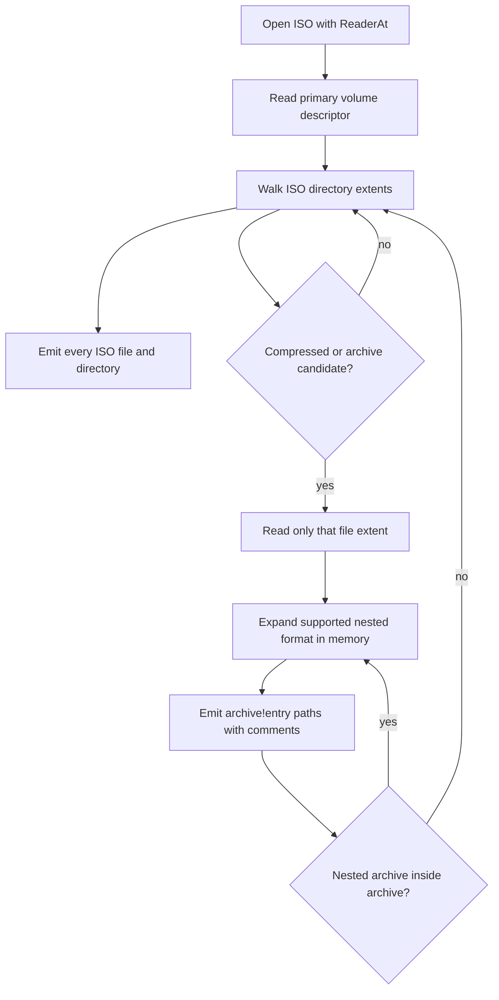

# Linux File Lister

`lfl` lists file names inside archives and disk images without extracting them.

The primary fast path is a native ISO-9660 scanner that reads directory extents
directly with `io.ReaderAt`, avoiding mounts and full-image extraction. When an
ISO contains compressed files or archives, `lfl` reads only those candidate file
extents and expands their contents into the same listing using `archive!entry`
paths.

## Supported inputs

- ISO-9660 images, including basic Rock Ridge names
- Recursive compressed/archive expansion for supported formats, including nested files inside ISO images
- tar, tar.gz, tar.bz2, tar.xz, tar.zst, tgz, tbz2, txz, tzst
- zip, jar, war
- gzip, bzip2, xz, zstd, and SquashFS filesystem images
- cpio `newc` archives
- rpm packages with supported payload compressors
- fallback listing through installed tools: `bsdtar`, `tar`, `7z`, `unrar`,
  `rpm2cpio`, `xz`, `zstd`, `gzip`, `bzip2`

## How ISO Listing Works



The scanner does not read the whole ISO image. It reads directory extents plus
file extents whose names indicate supported compressed content, then uses format
signatures while expanding nested payloads. xz and zstd recursion require the
corresponding Linux helper command to be installed.

## Repacked ISO Support

For teams that customize a base Linux ISO and repack it, `lfl` uses two layers:

1. A native ISO-9660 extent walker for speed and direct reads of nested payloads.
2. A `bsdtar`/libarchive catalog merge when available, which catches entries
   exposed through Rock Ridge, Joliet, UDF, or other repacked ISO metadata that
   the minimal native ISO parser may not see.

When libarchive finds archive candidates that were not already expanded by the
native extent walker, `lfl` extracts those candidates with `bsdtar -xOf` and runs
the same recursive archive expansion over them. This is important for repacked
installer media where the mounted view is richer than the primary ISO-9660 tree.

## Count Discrepancies

If a mounted ISO appears to contain far more files than a flat ISO directory
listing, the extra files are often inside compressed filesystem images such as
`install.img` or `filesystem.squashfs`. `lfl` detects SquashFS magic in ISO
`.img` and `.squashfs` candidates and expands it with `unsquashfs` when that
helper is installed. Without `unsquashfs`, the SquashFS image itself is still
listed and annotated, but its internal files cannot be enumerated.

## Build

```sh
go build ./cmd/lfl
```

## Usage

```sh
lfl path/to/archive.iso
lfl -json path/to/package.rpm
lfl -max-nested-depth 4 path/to/image.iso
lfl -mount-iso path/to/repacked.iso
```

The default output is one path per line with a trailing `# comment` when the
entry has context:

```text
dists/TRIXIE/MAIN/BINARY_A/Packages.gz	# ISO-9660 file extent
dists/TRIXIE/MAIN/BINARY_A/Packages.gz!content	# decompressed single-file stream from dists/TRIXIE/MAIN/BINARY_A/Packages.gz
```

JSON output emits records with path, type, size, source format, and optional
comment. A full Debian netinst ISO example is checked in at
`examples/debian-iso-output.txt`.

## Mounted ISO Fallback

When repacked media behaves differently from the native and libarchive catalog
views, Linux users can run `lfl -mount-iso image.iso`. This mounts the ISO
read-only with `mount -o loop,ro`, walks the mounted filesystem, recursively
expands supported archive files found in that mounted view, then unmounts. This
mode requires Linux privileges for loop mounting and is intentionally opt-in.

## Linux Container Mount Test

For testing `-mount-iso` from macOS or another non-Linux host, use Docker with a
Linux VM. The repo includes a narrow privileged runner:

```sh
scripts/run-mounted-iso-container.sh /path/to/repacked.iso .container-results
```

The runner cross-builds a Linux `lfl` binary, mounts only that binary, the target
ISO, and an output directory into the container, then runs:

```sh
lfl -mount-iso /input.iso > /out/mounted.out
```

This container must be privileged because Linux loop mounts require mount
capabilities. Only run it with ISO files and output directories you intend to
expose to the container.
