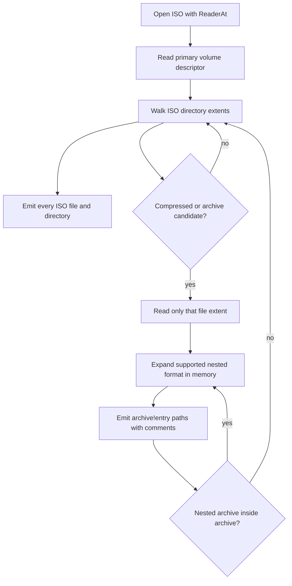

# Linux File Lister

`lfl` lists file names inside archives and disk images without extracting them.

The primary fast path is a native ISO-9660 scanner that reads directory extents
directly with `io.ReaderAt`, avoiding mounts and full-image extraction. When an
ISO contains compressed files or archives, `lfl` reads only those candidate file
extents and expands their contents into the same listing using `archive!entry`
paths.

## Supported inputs

- ISO-9660 images, including basic Rock Ridge names
- Nested compressed/archive files inside ISO images
- tar, tar.gz, tar.bz2, tgz, tbz2
- zip, jar, war
- gzip and bzip2 single-file streams
- cpio `newc` archives
- rpm packages with supported payload compressors
- fallback listing through installed tools: `bsdtar`, `tar`, `7z`, `unrar`,
  `rpm2cpio`, `xz`, `zstd`, `gzip`, `bzip2`

## How ISO Listing Works



The scanner does not read the whole ISO image. It reads directory extents plus
file extents whose names indicate supported compressed content, then uses format signatures while expanding nested payloads.

## Build

```sh
go build ./cmd/lfl
```

## Usage

```sh
lfl path/to/archive.iso
lfl -json path/to/package.rpm
lfl -max-nested-depth 4 path/to/image.iso
```

The default output is one path per line with a trailing `# comment` when the
entry has context:

```text
dists/TRIXIE/MAIN/BINARY_A/Packages.gz	# ISO-9660 file extent
dists/TRIXIE/MAIN/BINARY_A/Packages.gz!content	# decompressed single-file stream from dists/TRIXIE/MAIN/BINARY_A/Packages.gz
```

JSON output emits records with path, type, size, source format, and optional
comment.
