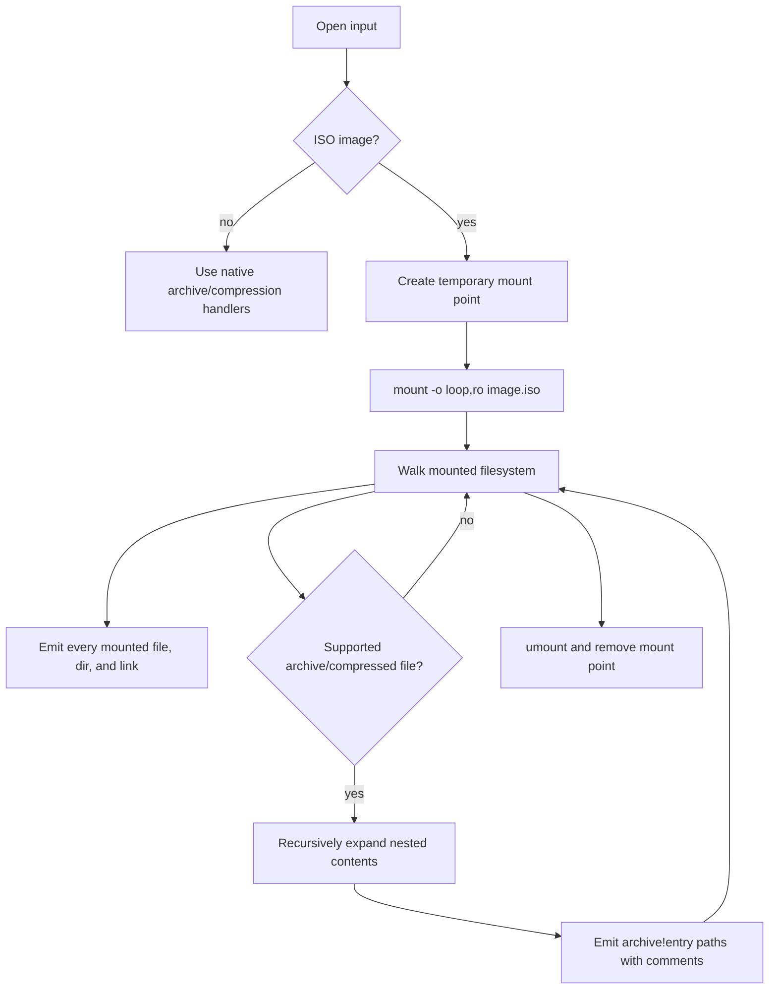

# Linux File Lister

`lfl` lists file names inside archives and Linux ISO images.

ISO handling is intentionally mount-based only. When input is an ISO, `lfl`
mounts it read-only on Linux, walks the mounted filesystem view, recursively
expands supported archive/compressed files found in that mounted tree, and then
unmounts during cleanup. This matches the way teams validate customized and
repacked base ISOs with hand-rolled mount scripts.

Non-ISO compressed/archive files are handled directly without mounting.

## Supported inputs

- Linux ISO images via read-only loop mount
- Recursive compressed/archive expansion for supported formats
- tar, tar.gz, tar.bz2, tar.xz, tar.zst, tgz, tbz2, txz, tzst
- zip, jar, war
- gzip, bzip2, xz, zstd, and SquashFS filesystem images
- cpio `newc` archives
- rpm packages with supported payload compressors
- fallback listing through installed tools: `bsdtar`, `tar`, `7z`, `unrar`,
  `rpm2cpio`, `xz`, `zstd`, `gzip`, `bzip2`

## How ISO Listing Works



This means ISO counts should align with a manual mount-and-find workflow, subject
to permissions and helper availability for nested payloads such as SquashFS.

## Repacked ISO Support

For teams that customize a base Linux ISO and repack it, the mounted filesystem
view is the source of truth. `lfl` no longer uses a separate native ISO catalog
path for ISO inputs. It mounts the final ISO, walks what Linux exposes, expands
nested archives from that view, and unmounts.

This mode requires Linux privileges for loop mounting. In containers, that
usually means a privileged container or equivalent mount capabilities.

## Count Discrepancies

If a mounted ISO appears to contain far more files than a flat ISO directory
listing, the extra files are often inside compressed filesystem images such as
`install.img` or `filesystem.squashfs`. `lfl` expands SquashFS when `unsquashfs`
is installed. Without `unsquashfs`, the SquashFS image itself is still listed and
annotated, but its internal files cannot be enumerated.

## Build

```sh
go build ./cmd/lfl
```

## Usage

```sh
lfl path/to/repacked.iso
lfl -json path/to/package.rpm
lfl -workers 8 path/to/large.iso
lfl -max-nested-depth 4 path/to/archive.tar.gz
```

The default output is one path per line with a trailing `# comment` when the
entry has context:

```text
images/install.img	# mounted ISO filesystem entry
images/install.img!etc/os-release	# inside compressed file images/install.img
```

JSON output emits records with path, type, size, source format, and optional
comment. A mounted ISO example output is checked in at
`examples/mounted-small-output.txt`. Current benchmark results are in
`BENCHMARKS.md`.

## Linux Container Mount Test

For testing ISO mounting from macOS or another non-Linux host, use Docker with a
Linux VM. The repo includes a narrow privileged runner:

```sh
scripts/run-mounted-iso-container.sh /path/to/repacked.iso .container-results
```

The runner cross-builds a Linux `lfl` binary, mounts only that binary, the target
ISO, and an output directory into the container, then runs:

```sh
lfl /input.iso > /out/mounted.out
```

This container must be privileged because Linux loop mounts require mount
capabilities. Only run it with ISO files and output directories you intend to
expose to the container.
