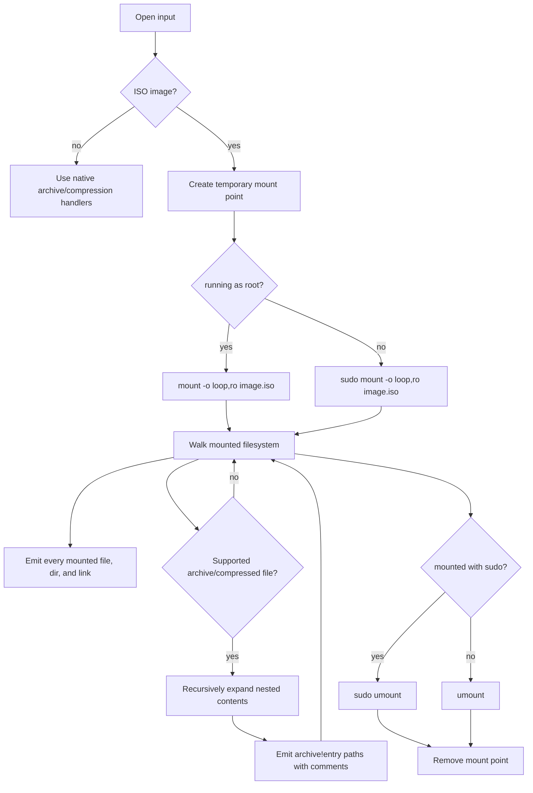

# Linux File Lister

`lfl` lists file names from Linux ISO images and common archive/compressed file
formats. ISO handling is mount-based only: for an ISO, `lfl` mounts the image
read-only, walks the mounted filesystem, recursively expands supported
compressed/archive files found inside that mounted tree, writes a listing file,
and unmounts during cleanup.

This matches the workflow used by teams that customize base Linux ISOs, repack
them, and validate the final ISO through Linux's mounted filesystem view.

## Install

```sh
go install github.com/Mjwagner2277/omega-file-lister/cmd/lfl@latest
```

Or build from the repo:

```sh
go build ./cmd/lfl
```

## Basic Usage

```sh
lfl path/to/repacked.iso
lfl path/to/archive.tar.gz
lfl path/to/package.rpm
```

By default, `lfl` writes one output file per input in the current working
directory. It does not print the file list to stdout.

Output names use the input filename with dots converted to underscores, plus
`_files`:

```text
rocky.iso          -> rocky_iso_files
some_thing.rpm     -> some_thing_rpm_files
archive.tar.gz     -> archive_tar_gz_files
```

Use `-json` to write JSON lines instead of text. JSON output uses the same base
name with `.json` appended:

```sh
lfl -json some_thing.rpm
```

```text
some_thing_rpm_files.json
```

## Common Commands

```sh
lfl rocky.iso
lfl -json package.rpm
lfl -workers 8 large.iso
lfl -mount-dir ~/lfl-mounts rocky.iso
lfl -quiet archive.tar.gz
lfl -max-nested-depth 4 archive.tar.gz
```

Flags:

```text
-json              write JSON lines to <input_name>_files.json
-mount-dir DIR     create ISO mount points under DIR instead of system temp
-no-sudo-mount     do not use sudo for ISO mount/umount as a non-root user
-quiet             hide progress messages on stderr
-workers N         worker count for mounted ISO nested archive expansion
-max-nested-depth  recursive nested archive depth limit
```

## Development Checks

```sh
make fmt        # rewrite Go files with gofmt
make fmt-check  # verify Go formatting without changing files
make lint       # run go vet
make test       # run the Go test suite
make check      # run fmt-check, lint, and tests
```

GitHub Actions runs the same format, lint, and test checks on pushes to `main`
and pull requests.

## Non-Root ISO Workflow

Do not run the whole app as root. Run `lfl` as your normal user:

```sh
lfl rocky.iso
```

When the input is an ISO and the process is not root, `lfl` runs only the mount
and unmount operations through `sudo`:

```sh
sudo -p "lfl sudo password: " mount -o loop,ro rocky.iso /tmp/lfl-iso-12345
sudo -p "lfl sudo password: " umount /tmp/lfl-iso-12345
```

If sudo needs authentication, the terminal shows:

```text
lfl sudo password:
```

Typical terminal flow:

```text
$ lfl rocky.iso
lfl: processing rocky.iso
lfl: rocky.iso: opening input
lfl: rocky.iso: detected ISO image; using Linux mount path
lfl: rocky.iso: creating temporary mount point
lfl: rocky.iso: mounting ISO read-only with sudo
lfl sudo password:
lfl: rocky.iso: walking mounted filesystem
lfl: rocky.iso: mounted filesystem walk complete (count=30, total=1)
lfl: expanding mounted archive candidates (count=1, workers=1)
lfl: mounted archive expansion complete (count=60735, total=1, workers=1)
lfl: rocky.iso: listed entries (count=60765)
lfl: rocky.iso: unmounting ISO with sudo
lfl: writing 60765 entries to rocky_iso_files
lfl: done: 60765 entries from 1 input(s) in 9.5s
```

ASCII flow:

```text
+--------------------------+
| user runs lfl as user    |
| lfl rocky.iso            |
+------------+-------------+
             |
             v
+--------------------------+
| create lfl-iso-* dir     |
| default: /tmp/lfl-iso-*  |
+------------+-------------+
             |
             v
+--------------------------+
| sudo mount -o loop,ro    |
| sudo may prompt password |
+------------+-------------+
             |
             v
+--------------------------+
| walk mounted filesystem  |
| expand nested archives   |
+------------+-------------+
             |
             v
+--------------------------+
| sudo umount              |
| remove temp mount dir    |
+------------+-------------+
             |
             v
+--------------------------+
| write rocky_iso_files    |
+--------------------------+
```

If your sudoers policy allows passwordless mount/umount, no password prompt is
shown. If you run from a non-interactive environment, sudo must already be
authenticated or configured not to require a password for the mount/umount
commands.

## Mount Directory

By default, ISO mount points are created under the system temp directory,
typically:

```text
/tmp/lfl-iso-12345
```

Override the mount root with `-mount-dir`:

```sh
mkdir -p ~/lfl-mounts
lfl -mount-dir ~/lfl-mounts rocky.iso
```

That creates a unique temporary mount point such as:

```text
~/lfl-mounts/lfl-iso-12345
```

The mount root must be writable by the user running `lfl`, because `lfl` creates
the temporary mount directory before it calls `sudo mount`.

Use `-no-sudo-mount` only when you explicitly want direct mount commands as the
current user:

```sh
lfl -no-sudo-mount rocky.iso
```

## Supported Inputs

- Linux ISO images via read-only loop mount
- Recursive compressed/archive expansion for supported formats
- tar, tar.gz, tar.bz2, tar.xz, tar.zst, tgz, tbz2, txz, tzst
- zip, jar, war
- gzip, bzip2, xz, zstd, and SquashFS filesystem images
- cpio `newc` archives
- rpm packages with supported payload compressors
- fallback listing through installed tools: `bsdtar`, `tar`, `7z`, `unrar`,
  `rpm2cpio`, `xz`, `zstd`, `gzip`, `bzip2`

RPM files found inside mounted ISOs or other supported archives are expanded
recursively through `rpm2cpio` when that helper is installed.

## How ISO Listing Works



This means ISO counts should align with a manual mount-and-find workflow,
subject to permissions and helper availability for nested payloads such as
SquashFS.

## Repacked ISO Support

For teams that customize a base Linux ISO and repack it, the mounted filesystem
view is the source of truth. `lfl` does not use a separate native ISO catalog
path for ISO inputs. It mounts the final ISO, walks what Linux exposes, expands
nested archives from that view, and unmounts.

## Count Discrepancies

If a mounted ISO appears to contain far more files than a flat ISO directory
listing, the extra files are often inside compressed filesystem images such as
`install.img` or `filesystem.squashfs`. `lfl` expands SquashFS when `unsquashfs`
is installed. Without `unsquashfs`, the SquashFS image itself is still listed and
annotated, but its internal files cannot be enumerated.

## Output Format

Text output is one path per line with a trailing `# comment` when the entry has
context:

```text
images/install.img	# mounted ISO filesystem entry
images/install.img!etc/os-release	# inside compressed file images/install.img
```

JSON output emits records with path, type, size, source format, and optional
comment to the `.json` output file.

A mounted ISO example output is checked in at
`examples/mounted-small-output.txt`. Current benchmark results are in
`BENCHMARKS.md`.

## Linux Container Mount Test

For testing ISO mounting from macOS or another non-Linux host, use Docker with a
Linux VM. The repo includes a narrow privileged runner:

```sh
scripts/run-mounted-iso-container.sh /path/to/repacked.iso .container-results
```

The runner cross-builds a Linux `lfl` binary, mounts only that binary, the target
ISO, and an output directory into the container, then runs:

```sh
lfl /input.iso
cp /input_iso_files /out/input_iso_files
```

This container must be privileged because Linux loop mounts require mount
capabilities. Only run it with ISO files and output directories you intend to
expose to the container.
